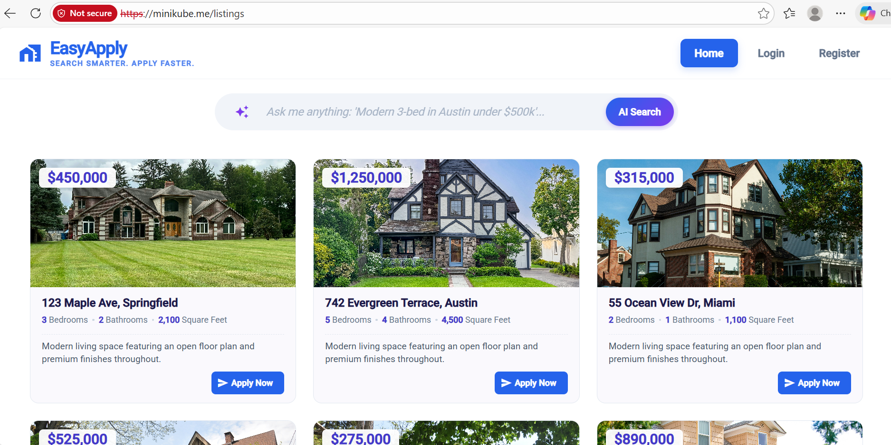
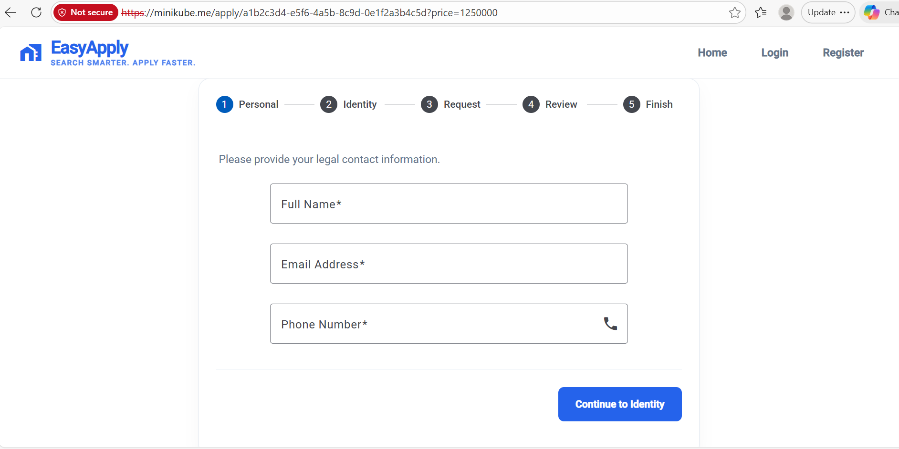
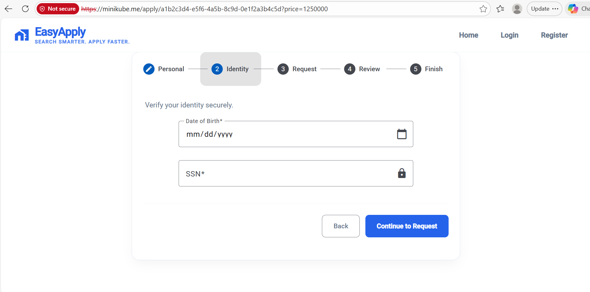
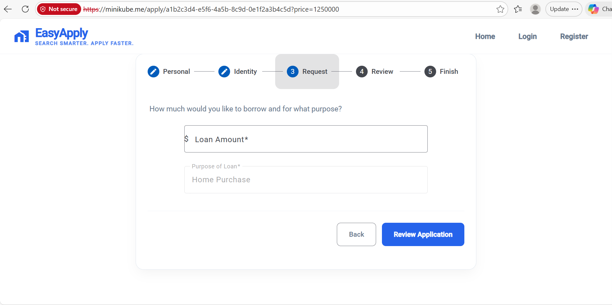
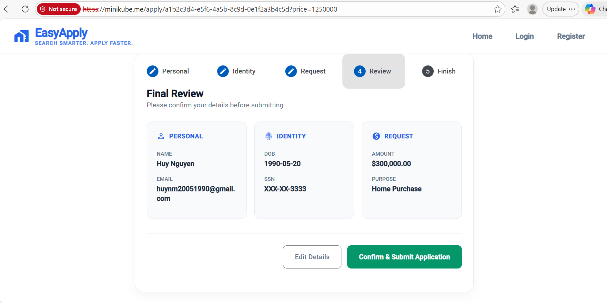
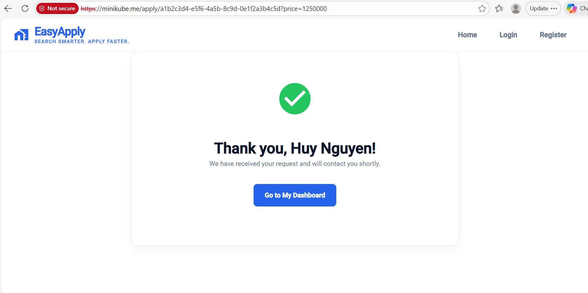

# 🏦 EasyApply

EasyApply is a microservices-based loan origination system designed for speed and reliability. 
Below is a walkthrough of the user journey through the application.

---

## 📸 Application Workflow

### 1. Home
The landing page where users can start finding their dream home.

### 2. Personal
Collection of basic user details to begin the profile.

### 3. Identity
Secure identity verification step to ensure applicant authenticity.

### 4. Request
Where the user specifies the loan amount.

### 5. Review
A final check of all submitted data before triggering the process.

### 6. Finish
Application submitted successfully. This triggers the background events via Kafka.

---

## 🛠️ Tech Stack
* **Architecture:** Microservices, Event-Driven
* **Frontend:** Angular
* **Backend:** Java, Spring Boot
* **Orchestration:** Kubernetes
* **Service Mesh:** Istio
* **Monitor Tools:** Kiali, Jaeger, EFK stack, Prometheus, Grafana
* **Messaging:** Apache Kafka
* **Database:** PostgreSQL